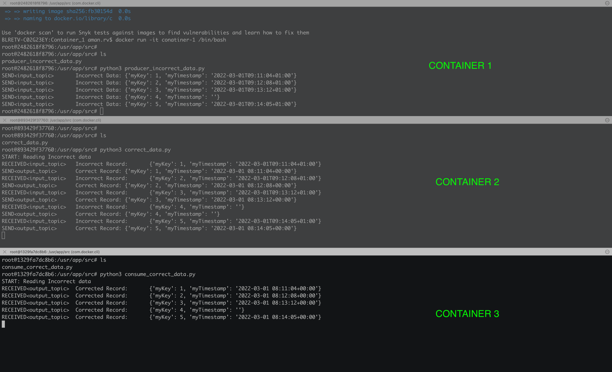

### Install Kafka and supporting services
```shell
$ docker-compose -f kafka_installation_docker_compose.yml up -d
Creating kafka-manager ... done
Creating kafka         ... done
Creating zookeeper     ... done

$ docker ps
CONTAINER ID   IMAGE                            COMMAND                  CREATED         STATUS         PORTS                                                  NAMES
fd7ae62be120   zookeeper                        "/docker-entrypoint.…"   7 seconds ago   Up 6 seconds   2888/tcp, 3888/tcp, 0.0.0.0:2181->2181/tcp, 8080/tcp   zookeeper
8cb70246befa   hlebalbau/kafka-manager:stable   "/kafka-manager/bin/…"   7 seconds ago   Up 6 seconds   0.0.0.0:9000->9000/tcp                                 kafka-manager
2dd9cb568147   wurstmeister/kafka               "start-kafka.sh"         7 seconds ago   Up 6 seconds   0.0.0.0:9092->9092/tcp                                 kafka
```

### Add cluster to Kafka Manager
* On any web browser, go to Kafka Cluster Manager and add Cluster
* Give a cluster name: `test`
* Cluster Zookeeper Hosts: `zookeeper:2181`
* Enable these options:
  * Enable JMX Polling (Set JMX_PORT env variable before starting kafka server)
  * Poll consumer information (Not recommended for large # of consumers if ZK is used for offsets tracking on older Kafka versions)
  * Enable Active OffsetCache (Not recommended for large # of consumers)

### Create Kafka Topics
```shell
$ python3 create_kafka_topic.py

Topics created: [input_topic, output_topic]
```

## Start Python Containers
### Container 1: Producer of incorrect data
```shell
$ cd Container_1
$ docker build -t conatiner-1 .
$ docker run -it conatiner-1 /bin/bash

# ls
producer_incorrect_data.py

# python3 producer_incorrect_data.py
SEND<input_topic>	Incorrect Data:	{'myKey': 1, 'myTimestamp': '2022-03-01T09:11:04+01:00'}
SEND<input_topic>	Incorrect Data:	{'myKey': 2, 'myTimestamp': '2022-03-01T09:12:08+01:00'}
SEND<input_topic>	Incorrect Data:	{'myKey': 3, 'myTimestamp': '2022-03-01T09:13:12+01:00'}
SEND<input_topic>	Incorrect Data:	{'myKey': 4, 'myTimestamp': ''}
SEND<input_topic>	Incorrect Data:	{'myKey': 5, 'myTimestamp': '2022-03-01T09:14:05+01:00'}
```

### Container 2: Consumer of Incorrect data and producer of correct data
```shell
$ cd Container_2
$ docker build -t conatiner-2 .
$ docker run -it conatiner-2 /bin/bash

# ls
correct_data.py

# python3 correct_data.py
START: Reading Incorrect data
RECEIVED<input_topic>	Incorrect Record:	{'myKey': 1, 'myTimestamp': '2022-03-01T09:11:04+01:00'}
SEND<output_topic>	Correct Record:	        {'myKey': 1, 'myTimestamp': '2022-03-01 08:11:04+00:00'}
RECEIVED<input_topic>	Incorrect Record:	{'myKey': 2, 'myTimestamp': '2022-03-01T09:12:08+01:00'}
SEND<output_topic>	Correct Record:	        {'myKey': 2, 'myTimestamp': '2022-03-01 08:12:08+00:00'}
RECEIVED<input_topic>	Incorrect Record:	{'myKey': 3, 'myTimestamp': '2022-03-01T09:13:12+01:00'}
SEND<output_topic>	Correct Record:	        {'myKey': 3, 'myTimestamp': '2022-03-01 08:13:12+00:00'}
RECEIVED<input_topic>	Incorrect Record:	{'myKey': 4, 'myTimestamp': ''}
SEND<output_topic>	Correct Record:	        {'myKey': 4, 'myTimestamp': ''}
RECEIVED<input_topic>	Incorrect Record:	{'myKey': 5, 'myTimestamp': '2022-03-01T09:14:05+01:00'}
SEND<output_topic>	Correct Record:	        {'myKey': 5, 'myTimestamp': '2022-03-01 08:14:05+00:00'}
```

### Container 3: Consumer of Correct data 
```shell
$ cd Container_3
$ docker build -t conatiner-3 .
$ docker run -it conatiner-3 /bin/bash

# ls
consume_correct_data.py

# python3 consume_correct_data.py
START: Reading Incorrect data
RECEIVED<output_topic>	Corrected Record:	{'myKey': 1, 'myTimestamp': '2022-03-01 08:11:04+00:00'}
RECEIVED<output_topic>	Corrected Record:	{'myKey': 2, 'myTimestamp': '2022-03-01 08:12:08+00:00'}
RECEIVED<output_topic>	Corrected Record:	{'myKey': 3, 'myTimestamp': '2022-03-01 08:13:12+00:00'}
RECEIVED<output_topic>	Corrected Record:	{'myKey': 4, 'myTimestamp': ''}
RECEIVED<output_topic>	Corrected Record:	{'myKey': 5, 'myTimestamp': '2022-03-01 08:14:05+00:00'}
```


### Close Kafka and related containers
```shell
$ docker-compose -f kafka_installation_docker_compose.yml down

Stopping zookeeper     ... done
Stopping kafka-manager ... done
Stopping kafka         ... done
Removing zookeeper     ... done
Removing kafka-manager ... done
Removing kafka         ... done
Removing network flexbus_default
```

### Reference
https://www.youtube.com/playlist?list=PLxoOrmZMsAWxXBF8h_TPqYJNsh3x4GyO4
